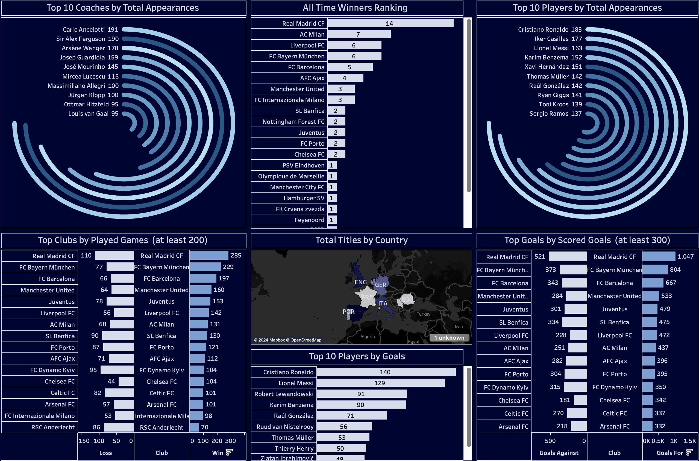

# ⚽ UEFA Champions League Analytics Dashboard

## 📌 Overview
This project provides interactive visual analytics on UEFA Champions League match data including player performance, team statistics, and match trends.

---

## ⚙️ Tech Stack
- SQL
- Tableau
- Data Visualization

---

## 📊 Key Features
- Player performance metrics
- Team comparison dashboards
- Match-level insights
- Interactive filters and drilldowns

---

## 🔍 Insights Generated
- Top-performing teams by season
- Player scoring trends
- Defensive vs attacking performance patterns

